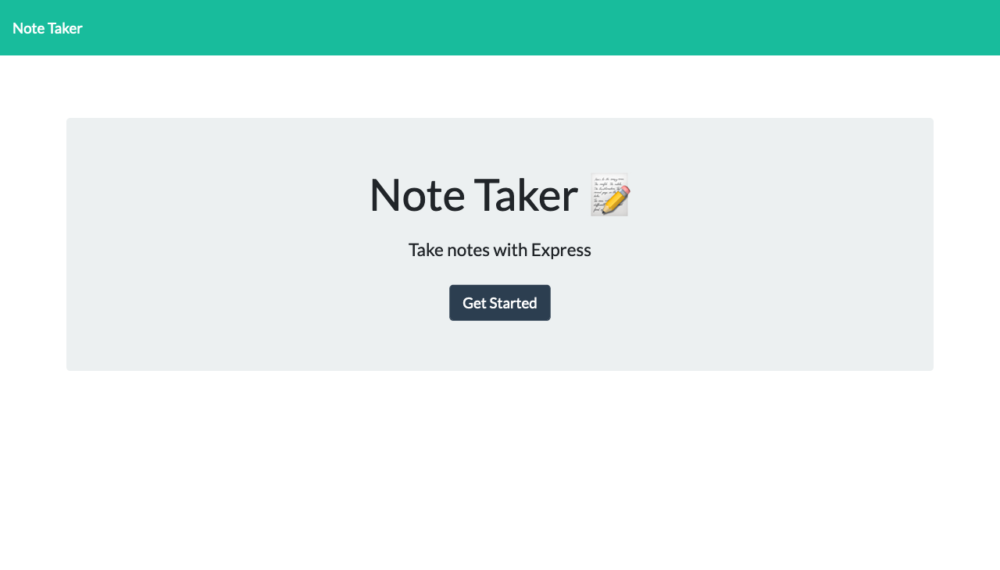
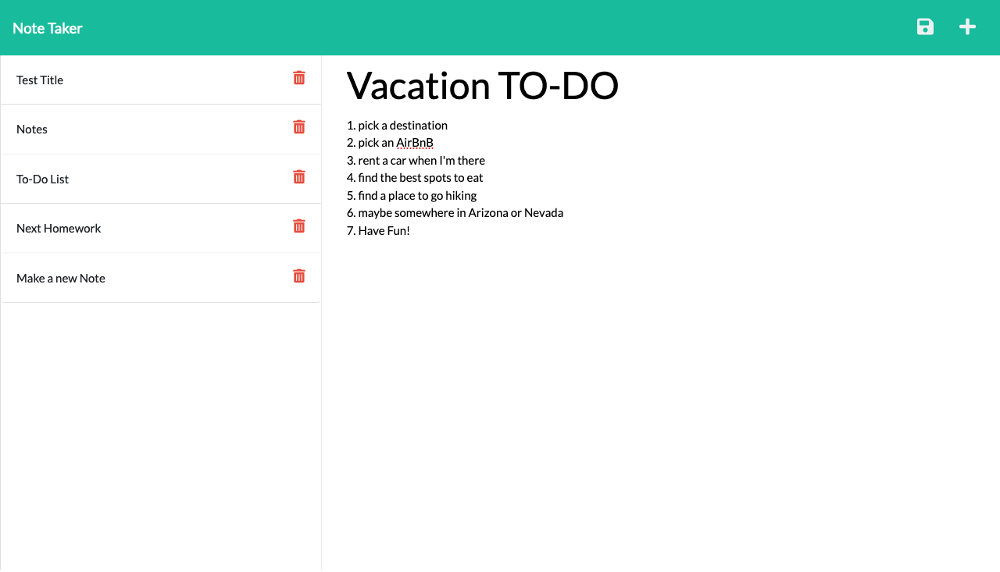

# Note-Pad
 

  ## Description: 
  This is a note-pad/note-taker application that is deployed from Heroku. This app has two pages that emcompass everything that it has; one being a landing page where once you click the central button it takes you to the note taking page. On this page you can write a title and body of the note and it will be saved to the data-base on the left side of the page. You can also delete notes with the red delete icon button next to the note on the left side of the page. You are also able to refresh your page and the note(s) will still be there unless your delete them. 
  ## Table of Contents:
  -- [Usage](#usage)

  -- [Installation](#installation)

  -- [License](#license)

  -- [Contributors](#contributors)

  -- [Github User Name](#Github-User-Name)

  -- [Email](#email)

  -- [Test](#test)
  
  ## Usage:
  Here is a link to a [demo](https://sheltered-dusk-87449.herokuapp.com/) 
  
  
  ## Installation:
   
  ## License:
   [License: MIT](https://opensource.org/licenses/MIT)
  Permission is hereby granted, free of charge, to any person obtaining a copy of this software and associated documentation files (the "Software"), to deal in the Software without restriction, including without limitation the rights to use, copy, modify, merge, publish, distribute, sublicense, and/or sell copies of the Software, and to permit persons to whom the Software is furnished to do so, subject to the following conditions: The above copyright notice and this permission notice shall be included in all copies or substantial portions of the Software. THE SOFTWARE IS PROVIDED "AS IS", WITHOUT WARRANTY OF ANY KIND, EXPRESS OR IMPLIED, INCLUDING BUT NOT LIMITED TO THE WARRANTIES OF MERCHANTABILITY, FITNESS FOR A PARTICULAR PURPOSE AND NONINFRINGEMENT. IN NO EVENT SHALL THE AUTHORS OR COPYRIGHT HOLDERS BE LIABLE FOR ANY CLAIM, DAMAGES OR OTHER LIABILITY, WHETHER IN AN ACTION OF CONTRACT, TORT OR OTHERWISE, ARISING FROM, OUT OF OR IN CONNECTION WITH THE SOFTWARE OR THE USE OR OTHER DEALINGS IN THE SOFTWARE. 
  ## Contributors:
  Me. 
  ## Github User Name:
  Here is a link to my Github: https://github.com/GundamMosi10
  ## Email:
  If you have any questions or would like to get in contact with me you can email me at this address: cargile10@gmail.com
  ## Test: 
  There are no tests associated with this project. 

